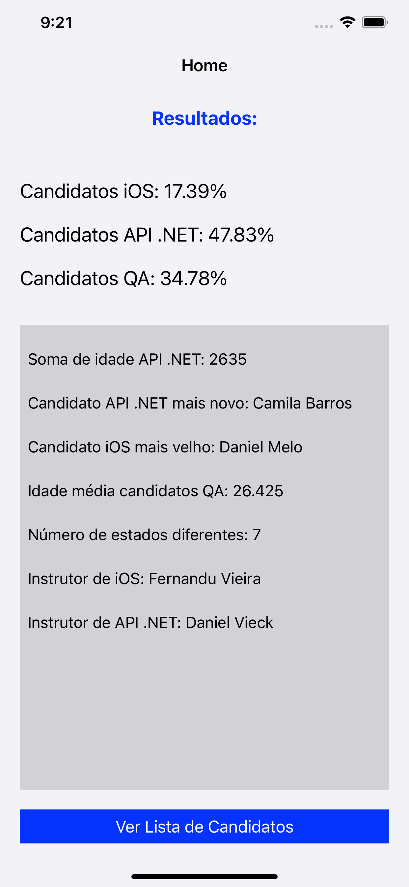
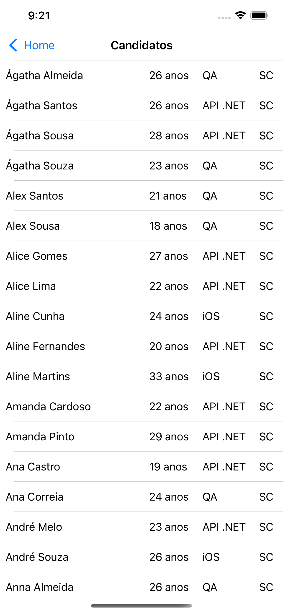

# Desafio-PremierSoft

Regras do desafio: [DesafioPremierSoft](https://github.com/premiersoft/AppAcademyChallenge2)

Author: [Leonardo Cunha](https://github.com/cunhaleo)

:white_check_mark: Foi possível solucionar, no desafio proposto: 
- Ordenar a lista em ordem alfabética e mostrá-la no programa.
- Identificar os instrutores de iOS e API .NET.
- Obter as informações pedidas a partir dos dados fornecidos.

:large_blue_circle: Resultado:

   
